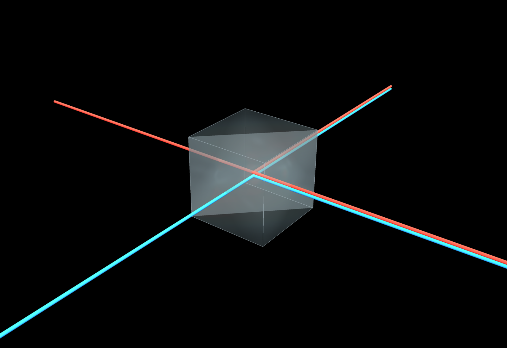
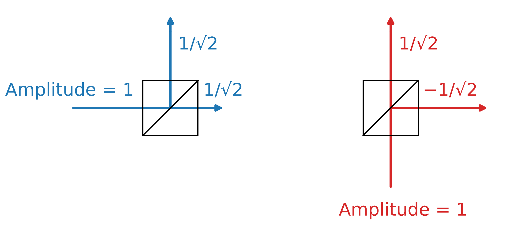
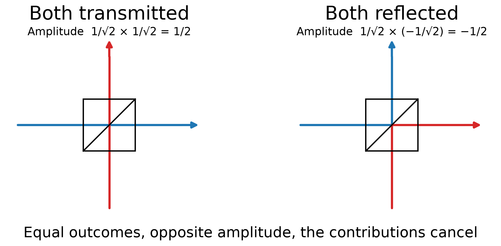
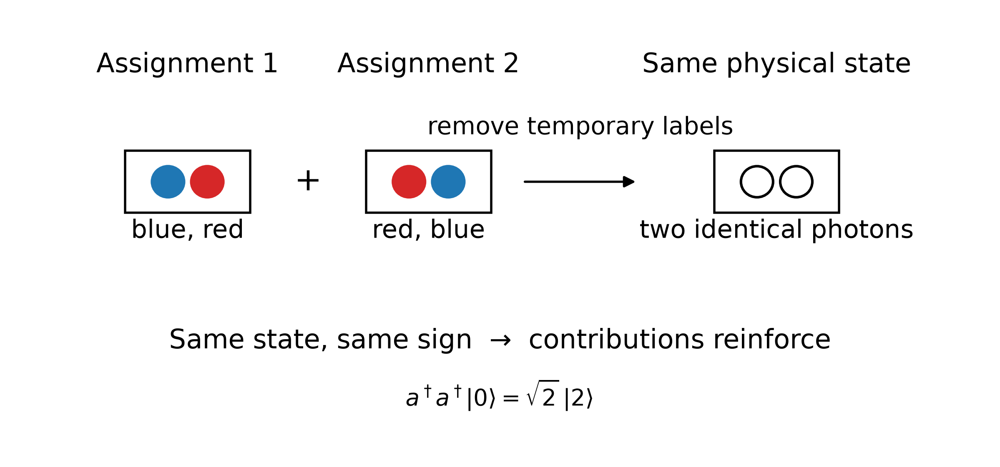
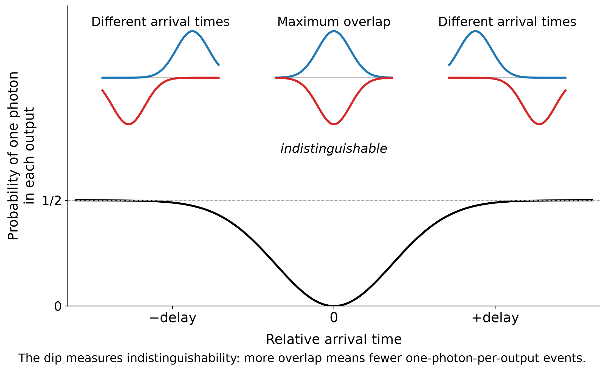

# The Quantum Effect of Light Passing Through a Window

*What happens when we look at reflection from a window one photon at a time? Quantum interference, indistinguishability, and bosonic symmetry appear in an everyday piece of glass.*

> **Image generated with PyVista by author.**

### At light levels low enough to count single photons, we can see quantum interference on everyday windows.

---

We are used to light being partially reflected and partially transmitted by a glass window. Classically, we say that the light wave is split. But what happens at the photon level? Does every photon simply decide randomly whether to reflect or pass through?

## Window as a Beamsplitter

If a light beam splits at a glass interface into two equally strong parts, the amplitudes will be reduced by a factor √2. (Remember, the intensity is proportional to the square of the amplitude.)

But we should also consider the phase. A beamsplitter introduces a relative phase between reflection and transmission — but not the same phase everywhere. Reflecting off the front of the glass reflective surface flips the phase by 180°. Reflecting off the back does not. Transmission, in either direction, has no phase flip at all.

This might sound like a technical detail, but it’s exactly what keeps energy conserved. Imagine two beamsplitters that first split a beam and then recombine it. If reflection worked the same way from both sides, the two recombined beams could each end up with the full intensity of the original — creating energy from nothing. The 180°/0° asymmetry between the two reflection directions is what prevents that.

## What Does a Single Photon Do at a Window?

What does this mean for a single photon?

The wave function follows essentially the same logic as the classical wave. The probability of finding the photon in an output port is the square of the corresponding amplitude, and, just as for the classical wave, the reflected and transmitted amplitudes have a relative phase.

At high light intensities we no longer detect the individual photons. The intensity of the beam is then simply split according to these probabilities. So, in this limit, we recover the familiar classical behaviour.

> **Figure 1. A photon entering either port of a 50/50 beamsplitter leaves in a superposition of the two outputs. Both possibilities have amplitude magnitude 1/√2, but reflection from one side introduces a minus sign. This relative phase will become important when two photons arrive together. Image by author.**

> *Alt text: Two diagrams of a 50/50 beamsplitter. A blue photon entering from one input splits into reflected and transmitted amplitudes of 1/√2. A red photon entering from the other input also splits into two amplitudes, but its reflected output carries a minus sign, −1/√2.*

> **The beamsplitter splits the photon wave function in equal parts.**

---

## When Two Photons Meet

Does this mean that a beamsplitter simply generates a 50/50 detection probability for any photon? It is more interesting than that.

Consider two photons entering the beamsplitter through different input ports. There are four possibilities. If the first photon is reflected and the second passes through, they both leave through one output port. If the first passes through and the second is reflected, they both leave through the other.

But look at the other two possibilities. If both photons pass through, or if both are reflected, we end up with one photon in each output port.

If the photons carried labels, we could distinguish these two outcomes. But identical photons do not carry such labels. *Both transmitted* and *both reflected* are therefore two histories leading to exactly the same final state.

Quantum mechanics tells us to add the amplitudes of indistinguishable histories, rather than their probabilities. And in this addition we have to consider the relative phase.

Photon 1 enters from the front, photon 2 from the back. If both reflect, photon 1’s reflection carries a 180° flip and photon 2’s does not — so the “both reflected” amplitude picks up an overall minus sign relative to “both transmitted.” Same magnitude, opposite sign: they cancel exactly.

So, the amplitude — and therefore the probability — of finding one photon in each output port is zero. This outcome simply does not occur.

> **Figure 2. Two photons enter different sides of a 50/50 beamsplitter. The outcome where one photon leaves each output port can arise through two alternatives: both photons are transmitted or both are reflected. For indistinguishable photons these alternatives lead to the same final state, but their amplitudes have opposite phase and cancel. The one-photon-per-output result disappears. The only possible outcomes are those where both photons leave the beamsplitter through the same output port. Image by author.**

> *Alt text: Two photons enter opposite sides of a 50/50 beamsplitter. Two alternative histories leading to one photon at each output are shown: both transmitted and both reflected. Their amplitudes have opposite signs and cancel.*

> **Quantum mechanics does not ask which indistinguishable history happened. It adds their amplitudes.**

---

## When the Histories Reinforce

So, if two identical photons enter the two input ports of the beamsplitter, they always leave together, either through one output port or through the other.

But how does that work with the probabilities?

For each individual photon, the probability of leaving through either port is 50%. We might therefore expect the probability of both photons leaving through one particular port to be 25%. There are two such ports, giving us only 50% in total. We seem to have lost half of the probability.

The resolution lies in how we treat identical bosons in quantum mechanics. Particles fall into two broad classes: bosons (such as photons and the Higgs boson) and fermions (such as electrons and protons). Multiple bosons can occupy the same quantum state, while identical fermions cannot.

When multiple identical photons occupy the same mode, there is an additional bosonic enhancement. For two photons, the amplitude acquires a factor √2 and therefore the probability acquires a factor 2.

So our apparent 25% probability for both photons leaving through one particular output becomes 50%. With two possible output ports, the probabilities once again add up to 100%.

> **Figure 3. Imagine temporarily labelling two photons blue and red. There appear to be two ways to create two photons in the same mode: blue then red, or red then blue. Once the labels are removed, however, these are not different physical outcomes. They describe the same state of two identical photons. For bosons the two assignments have the same sign, giving the characteristic √2 enhancement: a†a†|0⟩ = √2|2⟩. Image by author.**

> *Alt text: Two diagrams show a blue and a red photon occupying the same mode in opposite assignments: blue-red and red-blue. When the temporary colours are removed, both assignments describe the same state of two identical photons. Their contributions reinforce, producing the bosonic factor square root of two.*

## Where Does √2 Come From?

In quantum mechanics, we describe light in terms of modes that can contain 0, 1, 2, ... photons. We can add a photon to a mode using what is called a *creation operator* (a†). Starting from the empty state (the vacuum state), applying this operator *n* times gives

*a†ⁿ|0⟩ = √(n!) |n⟩.*

So, adding a second photon to a mode that already contains one photon does not give the same amplitude as adding the first photon to an empty mode. It comes with an additional factor √2, and adding the *n*-th photon will come with a factor √*n*.

But where does this factor come from?

One way to understand it is to temporarily imagine that the photons carry labels. There are two ways to assign two labelled photons to the same final two-photon state: photon A followed by photon B, or photon B followed by photon A. Once the photons are identical, these are no longer different physical states. Their amplitudes add.

For *n* identical photons there are *n!* such permutations. The √(*n*!) in the amplitude accounts for these different permutations when we construct the normalized *n*-photon state.

So, earlier we saw destructive interference between alternative ways to arrive at one photon in each output. Here we see the other side of the same principle: alternative ways to build the same bosonic state reinforce each other.

The deeper reason is the symmetry of identical particles. For bosons, the quantum state must be symmetric under exchange of two particles. For fermions it must be antisymmetric. That requirement is ultimately responsible for the Pauli exclusion principle for fermions.

> **The same indistinguishability that destroys one amplitude can enhance another.**

---

## When Are Two Photons Really Identical?

For two photons on a beamsplitter, we therefore see both destructive and constructive interference between different ways of producing the same outcome. This is different from the familiar interference between classical optical waves. Here it is the *two-photon wave function amplitudes* that interfere.

But there is an important condition: the different histories must really be indistinguishable. If we can, even in principle, distinguish them, the interference disappears.

Consider again the destructive interference that removed the outcome with one photon in each output port. As soon as we can distinguish the two photons, we can also distinguish the two histories. *Both transmitted* and *both reflected* are no longer two ways of arriving at exactly the same quantum state.

So, this triggers a question: can we experimentally vary how distinguishable two photons are and watch this quantum interference disappear?

We can. This is the **Hong–Ou–Mandel experiment** [1].

## Making Two Photons Miss Each Other

The idea is surprisingly simple. We send two photons towards opposite input ports of a 50/50 beamsplitter, but now we can slightly delay one of them. Behind the beamsplitter we place two detectors and count how often they click together.

If the photons arrive at very different times, they are distinguishable. There is no two-photon interference, and sometimes we detect one photon in each output.

We now gradually reduce the delay. As the two photon wave packets start to overlap, it becomes increasingly difficult to tell which photon was which. The two histories become indistinguishable and begin to interfere.

When the photons overlap perfectly, the coincidence probability reaches its minimum. For perfectly indistinguishable photons and an ideal 50/50 beamsplitter, it becomes zero.

Plotting the coincidence rate against the relative delay gives the characteristic **Hong–Ou–Mandel dip**.

> **Figure 4. Delaying one photon relative to the other changes how much their wave packets overlap. At large positive or negative delays, the photons arrive at different times and the probability of finding one photon in each output approaches 1/2. At zero delay the photons overlap, the two alternatives become indistinguishable, and this probability drops to zero. The Hong–Ou–Mandel dip therefore measures how indistinguishable the two photons are [1]. Image by author.**

> *Alt text. Plot of the probability of finding one photon in each beamsplitter output versus relative arrival time. Wave-packet diagrams show photons arriving in opposite orders for negative and positive delays, and overlapping at zero delay. The probability falls from one half for separated photons to zero at maximum overlap.*

> **The HOM dip lets us turn indistinguishability into something we can measure.**

---

## Time Is Only One Possible Label

Arrival time is not special. Suppose the photons arrive at exactly the same time, but one is horizontally polarized and the other vertically polarized. We can now distinguish them by polarization, and the HOM interference disappears.

The same is true for frequency, spatial mode, or any other physical property that contains information about which photon is which.

This gives us a more precise meaning of "indistinguishable". Two photons do not merely have to look identical to our detectors. Their complete quantum states must overlap.

> **Time, polarization, frequency, spatial mode — almost anything can become a label.**

There is another subtle point. Nobody actually has to measure the polarization, frequency, or arrival time.

If the information exists in principle, the alternatives are distinguishable. We can no longer add their amplitudes as if they were the same history.

So, choosing not to look at a label is not the same as removing the label.

> **It is not enough that we choose not to look. The alternatives must leave no physical information that distinguishes them.**

---

## How Indistinguishable Is Indistinguishable?

This turns the Hong–Ou–Mandel experiment into something more useful than a demonstration of a strange quantum effect.

The depth of the HOM dip tells us how well the complete quantum states of the two photons overlap. Perfectly indistinguishable photons ideally produce no coincidences at zero delay. Any remaining distinguishability reduces the interference and makes the dip shallower.

So, the strange disappearance of one possible outcome becomes a practical measurement of photon indistinguishability.

> **The HOM dip measures how completely two quantum states overlap.**

---

## Why Do Photons Bunch?

We often describe the Hong–Ou–Mandel effect by saying that photons "bunch": two identical photons entering different ports of a beamsplitter prefer to leave together.

That description is useful, but it can also be misleading. There is no attractive force pulling the photons together. In fact, the photons do not interact with each other at all.

What changes are the amplitudes of the wave function for the possible two-photon outcomes. The amplitudes leading to one photon in each output cancel, while the amplitudes associated with two photons occupying the same output mode reinforce.

> **Bosonic bunching is not an attraction between photons. It is what remains after indistinguishable quantum amplitudes reinforce and cancel.**

---

## From a Quantum Oddity to a Quantum Tool

At first sight, the Hong–Ou–Mandel effect may look like a particularly elegant demonstration of quantum mechanics. But indistinguishability has become something we can engineer and use.

If two photons produce a deep HOM dip, we know that they are very close to occupying the same quantum state. This becomes particularly important when the photons come from different sources. Before we can make such photons interfere in a larger quantum optical experiment, we need to know whether Nature can tell them apart.

And the same two-photon interference appears in some of the basic building blocks of quantum information. Beamsplitters and indistinguishable photons can be used to distinguish some entangled Bell states, and therefore play a role in photonic quantum teleportation, entanglement swapping and optical quantum computing.

Interestingly enough, the effect that started with the disappearance of one possible detector outcome has become a way of processing quantum information.

> **The disappearance of photon identity becomes something we can engineer and use.**

---

We started with something ordinary: light reflecting from a window.

At high light intensities, nothing looks particularly quantum. Some of the light is reflected, some is transmitted, and classical wave optics describes what we see extremely well.

But reduce the light until we can follow individual photons, and the same piece of glass starts telling a different story. One photon explores reflected and transmitted possibilities. Two photons force us to add indistinguishable histories. Some histories cancel completely, while others are enhanced by the symmetry of identical bosons.

Nothing about the glass itself became more quantum. We simply started asking questions for which the classical description no longer contains enough information.

And perhaps that is the most interesting part of the Hong–Ou–Mandel effect. Quantum mechanics does not only appear in exotic particles, giant accelerators or carefully isolated quantum computers. The basic ingredient can be something as simple as two photons and a partially reflecting piece of glass.

> **Perhaps we see quantum mechanics every time we look through a window. We normally just send far too many photons through it to notice.**

---

## Reference

[1] C. K. Hong, Z. Y. Ou, and L. Mandel, "Measurement of subpicosecond time intervals between two photons by interference," *Physical Review Letters* **59**, 2044–2046 (1987).